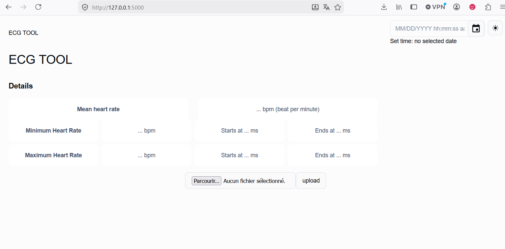

# Heart monitoring 

## Prerequisites

The project has been made and tested on ubuntu os

The following project needs the following setup to be launched:
- conda or any other virtual environment
- npm
- nodejs


## Run project
### Installation
```
conda env create  heart_ming_env --file environment.yml
conda activate 
pip install -r requirements.txt

cd frontend
npm install

gunicorn --bind 0.0.0.0:5000 wsgi:app
```
and reach [http://127.0.0.1:5000](http://127.0.0.1:5000)

You will be able to access to the following interface where you can upload your ecg file and compute heart rate and beat per minute. 



## Run server only

```
python app.py
```

debug mode
```
flask –app app.py –debug run
```

## Run web browser (development mode)

```
npm start

```
## Build static files for front-end
```
npm run build
```

## TODO:

- front end
    - handling http or bad request error (eg 404)
    - fixing vulnerabilities pointed out by `npm`

- middleware
    - the software as it is is not suited for production. Middleware is missing

- backend
    - missing documentation in the methods due to lack of time
    - correct the warning outputed in the logs 
    - heart rate computation: using the mean of the wave_offest and wave_onset (what I called QRS_time) instead of the wave onset reduces uncertainty by .5 (assuming there is a small but non negligeable uncertainty when measuring wave_onset and wasv_offset)

- shippment:
    - use docker to ship and deploy